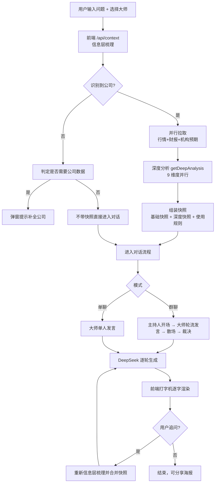

# 大师吵股 · 产品需求与技术实现文档（PRD）

> 本文档用于记录「大师吵股」站点的业务逻辑与实现规则，方便翻阅、追溯与交接。
> 最后更新：2026-09-17（一页纸财务诊断清单按侦查 PRD 打磨）

---

## 0. 文档说明

- **读者**：产品负责人、开发者、潜在收购/交接方
- **范围**：从「用户输入问题」到「大师输出发言/裁决」的完整业务链路，含问题解析、数据查询、深度分析、风格控制、快照组装、前端交互
- **配套文件**：`memory/architecture.md`（系统架构）、`memory/log.md`（决策记录）、`memory/project.md`（旧项目残留，可忽略）

---

## 1. 产品概述

### 1.1 一句话定位
一个让用户**向一群"投资大师"提问股票问题、看大师们带着真实数据互相辩论**的网站。

### 1.2 核心玩法
| 模式 | 说明 |
|---|---|
| **群聊辩论** | 用户选 2+ 位大师提问 → 主持人开场 → 大师们轮流发言、互相反驳（火药味） → 主持人散场 → 智囊团裁决 |
| **单聊深聊** | 用户与一位大师一对一问答（首轮带立场标记，追问为纯问答） |
| **追问** | 在结论基础上继续追问，大师们针对追问补充发言并更新裁决 |

### 1.3 核心卖点
- **数据支撑**：发言必须引用最新行情/财务/深度分析数据，禁止编造数字
- **风格还原**：32 位预置大师各有性格、话术、知识域；也可在线构建虚拟大师
- **深度分析**（2026-08-11 新增）：移植 UZI-Skill 的 9 大分析维度，让大师从"聊观点"升级为"用数据互怼"

---

## 2. 产品功能清单

| 模块 | 功能 |
|---|---|
| 大师选择 | 预置 **70 位**大师（32 原有 + 38 位 UZI 评审团扩充），按**流派分组**（价值/成长/中国价值/宏观/游资/短线/敢死队/量化/技术/维权/科技/AI卡位等 18 组）+ 筛选 / **多标签**：每位大师可带多个标签（如章盟主：A股游资+短线+敢死队），列表展示、可按任意标签筛选 / 自定义虚拟大师 / 快捷邀请（quickPicks）/ **智能选角**：按问题匹配最适合回答的 1-5 位大师（默认模式，列表锁定）/ **手动选择**：手选大师（无全选） |
| 群聊辩论 | 主持人 + 多轮发言 + 散场 + 裁决 |
| 单聊深聊 | 一对一问答 |
| 追问 | 多轮跟进 + 裁决更新 |
| 数据注入 | 自动解析公司 → 行情/财务/深度分析快照注入 AI |
| 补充公司 | 检测到问题涉及股票但未点名时，弹窗提示补全 |
| 小白解释 | 每条大师发言旁提供「看不懂？小白点这里看解释」，浮层用大白话解释专业术语与大师思路 |
| 分享海报 | 1080×1920 辩论海报生成（二维码） |
| 本地持久化 | 主题/语言/聊天方式/讨论状态 localStorage 保存 |
| 虚拟大师构建 | 输入名字 → 联网搜集资料 → 生成画像（含定制配方 recipes） |
| 大师实盘联赛 | 单一公开赛；六位历史大师与用户邀请大师统一获得 10 万元额度，按真实 A 股累计收益率排名 |
| 功能箱 | 左侧单一入口收纳芒格财报、缠中说禅、纳瓦尔知识学堂、鱼大基础面研究；箱内四个 Tab 切换，兼容旧模块 URL |

---

## 3. 核心流程：一次提问的完整链路

### 3.1 总体流程图



### 3.2 关键步骤说明

1. **问题解析**（见 §4）：从问题里识别出具体公司（最多 5 家）。
2. **数据快照**（见 §5、§8）：为前 2 家公司生成「基础快照 + 深度快照」，其余公司只生成基础快照。
3. **对话生成**（见 §7）：前端按剧本（sequence）逐条调 `/api/chat`，每次请求都携带同一份快照。
4. **渲染**：打字机逐字显示，发言带立场标记（看多 ▲ / 看空 ▼ / 中性 —）。

---

## 4. 信息层梳理：问题解析

> 代码位置：`src/app/api/chat/marketData.js`（resolveSymbols 等）、`src/app/api/chat/quoteContext.js`

### 4.1 解析目标
从用户问题中提取**具体公司**（A股/港股/美股，支持中文名、数字代码、英文代码），并判定"这个问题是否需要公司数据"。

### 4.2 公司解析流水线（按优先级依次尝试，全部结果按 secid 去重）

| 步骤 | 方法 | 说明 |
|---|---|---|
| ① LLM 提取 | DeepSeek（temperature=0）从问题中提取明确提到的公司名，返回 JSON 数组 | 最稳，覆盖口语化表达；结果按问题缓存 1 小时 |
| ② 词典匹配 | `COMMON_SYMBOLS` 常量表（约 130 家常见公司中文名/别名 → 代码/市场/secid），按名称长度倒序匹配 | 兜底、零延迟 |
| ③ 英文代码匹配 | 正则 `\b[A-Z]{2,5}\b` 提取英文代码（过滤停用词），数字代码 `\b\d{6}\b`（6 开头→沪，0/3 开头→深） | 支持 NVDA、600519 |
| ④ 启发式中文名 | 中文公司后缀词典（集团/股份/科技…）切词 + 分段剥离问法词 | 覆盖词典外的公司 |
| ⑤ 东财搜索解析 | `searchEastMoney` 调东方财富 suggest 接口，按 A股→港股→美股优先级取第一个；A股兼容旧 `AStock` 与科创板 `Classify=23` | 最终确认代码/市场，支持“宇树”等中文简称 |

### 4.3 "是否需要公司数据"判定

- 规则正则 `STOCK_QUESTION_RE`（股票/买/卖/估值/财报/仓位…）粗筛
- 用户明显在说自己持仓但没点名（`NEEDS_COMPANY_RE`：我买了/重仓/套牢/满仓…）→ 提示补全
- 概念/方法论/大盘宏观类问题（什么是/如何/解释/方法论…）→ 不提示，直接进入对话
- 兜底：调用 DeepSeek 判断 `{"need": true/false}`（temperature=0）

### 4.4 特殊处理
- **ST 股防误判**：问题含"ST+中文"（如 ST合力泰）时，丢弃裸"ST"（避免误识别为美股 Sensata 代码）
- **多公司**：最多解析 5 家，快照按序展示

---

## 5. 数据查询层（市场数据）

> 代码位置：`src/app/api/chat/marketData.js`（统一数据层）

### 5.1 数据源总览（双源容错）

| 数据 | 主源 | 备用 |
|---|---|---|
| 名称/代码解析 | 东财 suggest（searchapi.eastmoney.com） | — |
| 实时行情（价格/涨跌/市值/PE/PB/行业板块） | 东财 push2 | Yahoo（美股/港股补字段） |
| A股财务（最新季报/年报） | 东财 F10（ZYZBAjaxNew） | — |
| 美股/港股财务 | 东财 datacenter（USF10/HKF10） | Yahoo quoteSummary |
| A股业绩预告 | 东财 datacenter（RPT_PUBLIC_OP_NEWPREDICT） | — |
| A股机构一致预期 | 东财 F10 ProfitForecast（1-3 年 EPS/PE/ROE + 综合评级） | — |
| 美股分析师预期 | Yahoo quoteSummary（recommendationTrend/earningsTrend） | — |

### 5.2 缓存与超时策略
- **TTL 缓存**：行情 3 分钟 / 财务 30 分钟 / 解析 24 小时 / 搜索建议 5 分钟；普通失败负缓存 60 秒，行情失败不写负缓存并自动重试一次
- **超时**：东财请求 8s，F10 10s，Yahoo 合并 3s 超时保护
- **容错原则**：任何单个请求失败不致命，返回空/降级；美股/港股 Yahoo 不可达时忽略

### 5.3 关键字段
- 东财行情字段：f43 价格、f57 代码、f58 名称、f59 小数位、f60 昨收、f116 总市值、f162 PE(TTM)、f167 PB、f170 涨跌幅、f127 行业板块名（如 白酒Ⅱ/通信设备）
- 盘前/休市时 `f43` 可能为 `0`；当 `f60 > 0` 时用昨收降级，并返回 `isPreviousClose=true`，展示与 AI 快照均标注“上一交易日收盘”，不得把 `0` 当真实股价。
- 模糊搜索使用 `GET /api/stock-search?q=关键词`，返回 A 股名称、代码与 secid；用于行业周期输入框候选下拉。中文单字（如「茅」「中」「化」）也允许触发候选，英文/数字仍至少 2 位，6 位纯代码不请求候选。

---

## 6. 深度分析引擎（UZI-Skill 移植）

> 代码位置：`src/app/api/chat/uziSkills.js`
> 设计思想：**确定性计算与 AI 判断分离**——量化指标（估值分位/DCF/技术面/杀猪盘信号/同行对标）全部由代码算成硬数字，AI 只负责解读和辩论，不能编造。

### 6.1 九大维度明细

| # | 维度 | 数据来源 | 计算/输出逻辑 | 降级 |
|---|---|---|---|---|
| 1 | **五年财务历史** | 东财 MAINFINADATA（24 期） | 逐年营收/净利/增速/ROE；最新期毛利率/净利率/负债率/每股现金流 | 失败 → 省略该行 |
| 2 | **PE/PB 估值分位** | 东财 K线（不复权年度收盘）× 年报 EPS/BPS | 每年 PE=年末价/EPS、PB=年末价/BPS；当前 PE/PB 在近 5 年序列的百分位；>80% 偏高、<20% 偏低、其余中性 | 历史不足 3 年 → 省略 |
| 3 | **K线技术指标** | A股：东财 push2his；美股/港股：Yahoo chart 优先、东财兜底 | MA5/10/20/60、RSI14、MACD（DIF/DEA）、KDJ、近 20/60 日涨幅、年内涨幅、年化波动率、近一年最大回撤、量比（最新量/20日均量）、连续涨停天数、均线排列（多头/空头/震荡）、52 周高低 | 无 K线 → 省略 |
| 4 | **龙虎榜** | 东财 datacenter（RPT_BILLBOARD_DAILYDETAILSBUY，近 45 日） | 上榜次数、净买卖额、席位（机构专用/沪深股通→机构；其他→游资）、上榜原因 | 无上榜 → 省略 |
| 5 | **研报评级** | 东财 reportapi（近 12 月） | 研报总数、评级分布（买入/增持/中性…）、平均预测今年 EPS | 无研报 → 省略 |
| 6 | **社交热榜命中** | 微博/知乎/百度/抖音/头条/B站 官方 JSON 接口（5 分钟缓存） | 公司名/简称在热榜标题命中 → 计数 + 平台 + 条目；单平台失败不影响其他 | 全部失败 → 省略 |
| 7 | **杀猪盘扫描** | 综合 K线 + 财务 + 热榜 | 见 6.2 | 恒有输出 |
| 8 | **DCF 估值** | 财务历史（最新年报经营现金流为 FCF 基数） | 见 6.3 | 数据不足 → 输出"无法 DCF" |
| 9 | **同行对标** | 行情 f127 行业板块名 → 东财 suggest 解析板块代码 → 板块成分股（市值 Top8） | 中位 PE/PB、本股 PE/PB 在同行中的分位、估值高于/低于同行、按中位 PE×本股 EPS 的隐含价 | 无板块/可比 <2 家 → 省略 |

### 6.2 杀猪盘扫描规则（UZI 8 信号降级版）

| 信号 | 判定条件（代码阈值） |
|---|---|
| K线异常配合 | 近 60 日涨幅 ≥50%（或近 20 日 ≥25%）；或连续涨停 ≥3 天；或量比 ≥2.5 |
| 基本面与热度脱节 | 上热榜且 ROE<5%，或上热榜且亏损 |
| 跨平台联动 | 热榜实际命中 ≥3 条 且（涨幅 ≥25% 或 ROE<5% 或 市值<300 亿）（对白马降噪） |

**等级映射**：命中 0-1 → 🟢 安全（9-10 分）；2-3 → 🟡 注意（6-8）；4-5 → 🟠 警惕（3-5）；6+ → 🔴 高度可疑（1-2）
> 注意：杀猪盘为量化信号扫描，不是结论，需结合基本面综合判断。

### 6.3 DCF 估值参数（移植 UZI fin_models.py）

| 参数 | 值 |
|---|---|
| 无风险利率 rf | 2.5%（10 年国债） |
| 股权风险溢价 ERP | 6% |
| Beta | 1.0（可被行情 Beta 覆盖） |
| 税率 | 25% |
| 债务成本（税前） | 4.5%，目标负债率 30% |
| WACC | 权益成本×0.7 + 税后债务成本×0.3 |
| 两段增长 | 第 1-5 年 10% → 第 6-10 年 5% |
| 永续增长 g | 2.5% |
| 输出 | 每股内在价值、安全边际 =（内在价值/现价-1）、5 档裁决（低估/略低估/合理/高估/数据不足） |
| 已知简化 | 净债桥缺失时 EV≈股权价值（附注说明）；FCF 缺失时按 净利×0.8 估算（标注"估算"） |

### 6.4 调度与预算
- `getDeepAnalysis` 并行拉 6 路独立数据 → 再并行计算依赖项（估值分位/同行对标/热榜）
- 每次提问最多对 **前 2 家公司** 做深度分析，整体 **10 秒预算**，超时只缺该项不拖垮聊天
- 所有维度独立 try/catch，单维度失败不影响其他

---

## 7. 表达层：风格控制与提示词

> 代码位置：`src/lib/prompts.js`、`src/data/masters.js`

### 7.1 风格基调
- **固定辩论模式**：真实互怼、火药味十足；后发言者必须直接反驳、引用前一位原话再批驳
- **数据支撑**：发言必须用具体数据/估值指标/历史案例举证，避免空泛观点
- **反幻觉约束**：引用数字以快照为准；快照没有的精确数字只能用"大约/约/可能"，**严禁用训练记忆里的旧数字冒充最新**
- **深度数据引用**（2026-08-11 新增）：快照含深度分析时，优先引用估值分位/DCF 安全边际/龙虎榜游资/研报/杀猪盘信号等数据点，并**点明命中项**（如"PE 处于近 5 年 87% 分位"）

### 7.2 大师画像体系（masters.js）
每个大师含字段：id / name / title（称号）/ style（风格）/ personality（性格）/ quote（金句）/ biography（经历）/ classicTheory（经典理论）/ knowledge（知识域与思维框架）/ coreViews（核心观点）/ phrases（常用话术）/ decisionHabits（决策习惯）/ riskPref（风险偏好）；自定义大师另含 styleSample（风格示范）。

### 7.3 各场景提示词

| 场景 | 函数 | 输出 |
|---|---|---|
| 主持人开场 | buildOpeningOnlyPrompt | 纯文本开场白（80-120 字，风趣毒舌可挑事） |
| 大师发言 | buildOneSpeechPrompt | JSON：`{investorId, stance(BULL/BEAR/NEUTRAL), content(120-180字), keyPoint}` |
| 主持人散场 | buildClosingOnlyPrompt | 纯文本散场总结（80-120 字） |
| 智囊团裁决 | buildVerdictOnlyPrompt | JSON：`{summary, bullCount, bearCount, neutralCount, consensus, mainRisk, valuationNote, trapWarning}` |
| 单聊深聊 | buildChatPrompt | 纯文本回答（观点→理由→证据→建议，150-300 字） |
| 追问 | buildFollowUpPrompt | JSON：`{discussion:[{investorId,stance,content,keyPoint}], verdict:{...}}` |

- 群聊发言解析容错：`safeJsonParse` 失败后必须继续用 `extractChatFields` 抽取 `content/keyPoint`；已完成列表、流式当前条和历史本地结果渲染前都走 `normalizeSpeechMessage`，禁止把 `{"investorId":...}` 整段 JSON 当正文显示。

### 7.4 小白解释（v2026-08-11 新增）
- 位置：每条大师发言（含流式打完后）气泡右下角，与 💡 总结（keyPoint）同一行右侧，「🤔 看不懂？小白点这里看解释」按钮
- 布局：气泡内操作行 `justify-content: flex-end`；`reply-btn` / `explain-btn` 在 `.speech-key` 内取消 `margin-left:auto`，避免 keyPoint 为空时「举手提问」被两个自动边距挤到中间。
- 逻辑：点击 → 右侧抽屉（drawer-overlay + explain-drawer，从右侧滑入，宽 560px/94vw，非弹窗）→ 调**专用流式接口 `/api/explain`**（SSE 边生成边推送，首段约 1s 到达）→ 展示两部分：「大师说了啥」（大白话总结）+「相关指标」（术语/指标解释）；不展示发言原文
- 缓存：同一发言解释结果缓存（explainCacheRef），重复点击不重复调用
- 失败降级：加载态「正在用大白话解释…」、失败显示错误提示
- 输出格式：buildExplainPrompt 要求分两段（【大师说了啥】/【相关指标】，指标用「· 」开头），展示层轻量渲染（renderExplainText：**加粗**→strong、· 列表→ul、【】标记行→小节标题、***→** 归一）；无 JSON 解析，直接流式渲染

### 7.5 裁决数据结构（v2026-08-11）
- 原字段：summary（综合总结）、bullCount/bearCount/neutralCount（站队数）、consensus（共识）、mainRisk（主要风险）
- 新增字段：**valuationNote**（估值结论，基于估值分位/DCF/同行对标）、**trapWarning**（杀猪盘/异动扫描结论）
- 前端只读取原字段，新增字段由 UI 兼容忽略，不影响现有展示

---

## 8. 快照组装规则

> 代码位置：`src/app/api/chat/quoteContext.js`

### 8.1 基础快照（每家公司）
- 行情：股价/涨跌/市值/PE/PB/股息率/52周区间/Beta
- 财务：最新季报/年报营收/净利/增速/毛利率/净利率/ROE/EPS/BPS/每股现金流/负债率
- 预期：业绩预告 + 机构一致预期（1-3 年预测，标注"预测"）

### 8.2 深度快照（前 2 家公司）
- 由 `formatDeepSnapshot` 生成 9 大维度精简文本（每维度 1-2 行）
- 以「── 深度分析快照（移植 UZI-Skill 数据维度/机构方法）──」为分隔标记

### 8.3 使用规则注入
快照末尾注入规则文本：引用数据必须以快照为准、快照外精确数字不得编造、预测数据需标注"预测"、杀猪盘信号需结合基本面判断。

---

## 9. 前端交互（简述）

> 代码位置：`src/app/page.js`、`src/components/*`

- **剧本驱动**：群聊按 `hostOpening → speech×N（随机顺序） → hostClosing → verdict` 逐条请求/渲染；单聊只有一条 speech
- **打字机**：逐字渲染 + 正在输入指示（TYPING_INDICATOR_MS=100、逐字 16ms、停顿 120ms）
- **持久化**：主题/语言/聊天方式/讨论状态 localStorage
- **分享海报**：`src/lib/poster.js` 客户端生成 1080×1920 海报（含二维码）
- **入群二维码**：侧栏底部「入群聊一聊」打开用户交流群二维码弹层；默认读取 `public/group-qr.png`，可通过 `NEXT_PUBLIC_GROUP_QR_URL` 覆盖；二维码过期时保持页面路径不变，直接替换默认资源
- **虚拟大师构建**：`/api/virtual-master` 联网搜集资料生成画像；`recipes.js` 为难点人物定制检索策略
- **快照传递**：`/api/context` 结果存 snapshotRef，随每条发言请求发给 `/api/chat`
- **免责声明**：页面底部固定展示「本站内容由 AI 生成，仅供学习交流与娱乐参考，不构成任何投资建议或意见」（i18n disclaimer，中英文）
- **字体**：正文/输入框/按钮一律无衬线字体（--font-sans，中文 PingFang/微软雅黑），仅网页标题（.header-title「大师吵股」）保留衬线（--font-serif）
- **智能选角**（群聊，默认模式）：侧栏「🎲 智能匹配 / ✋ 手动选择」双模式切换，智能匹配默认选中；智能模式下大师列表锁定不可勾选（半透明 + 禁止点击），无手动操作按钮；**每次提交问题自动按当次问题选角，人选随问题变化**（调 `/api/match-masters`，把问题 + 大师风格清单发给 DeepSeek，按问题类型匹配 2-5 位，不足随机补足；失败回退随机 5 人；同一问题服务端缓存 30 分钟）
- **手动选择**（群聊）：去掉全选按钮，用户手选大师；提供「✕ 清空」

---

## 10. 已知限制与降级策略

| 限制 | 表现 | 策略 |
|---|---|---|
| 北向资金个股持仓明细停发（2024-08 起） | 北向接口返回空 | 自动降级，不展示该维度（不硬塞 0 或假数据） |
| 部分平台热榜（微博等）海外访问可能 403 | 该平台无热榜数据 | 单平台失败隔离，不影响其他平台 |
| 杀猪盘为量化信号 | 只是"疑似特征" | 提示词明确要求结合基本面判断 |
| DCF 为简化模型 | 净债桥缺失、FCF 估算 | 输出附注说明（估算/缺失） |
| 美股/港股深度维度较轻 | 无财务历史/龙虎榜/研报 | A股专属维度，美股/港股仅 K线/DCF/热榜 |
| 海外部署访问国内数据源可能慢 | 部分维度超时 | 双源容错（东财↔Yahoo）、失败降级 |

---

## 11. 文件地图（代码导航）

```
src/
├── app/
│   ├── page.js                    # 前端主页面：对话流程/打字机/持久化/海报
│   ├── api/
│   │   ├── chat/
│   │   │   ├── route.js           # /api/chat：DeepSeek 代理 + 快照注入
│   │   │   ├── marketData.js      # 统一市场数据层（东财+Yahoo、缓存、容错）
│   │   │   ├── quoteContext.js    # 信息层梳理：问题解析 + 快照组装
│   │   │   └── uziSkills.js       # ★ 深度分析引擎（UZI 移植，9 大维度）
│   │   ├── context/route.js       # /api/context：返回数据快照
│   │   ├── explain/route.js        # /api/explain：小白解释流式接口（SSE）
│   │   ├── match-masters/route.js  # /api/match-masters：智能选角
│   │   └── virtual-master/route.js# 虚拟大师画像构建
├── components/                    # 卡片/头像/大师详情弹窗等 UI
├── data/
│   ├── masters.js                 # 70 位预置大师画像（32 原有 + 合并 UZI，均带 tag 流派标签）
│   ├── masterGroups.js             # 大师流派分组配置（14 组顺序 + 中英文标签 + 归一化）
│   ├── uziMasters.js              # ★ UZI-Skill 66 人评审团扩充（38 位，含 tag 标签）
│   ├── presetMasters.js           # 预置大师数据
│   ├── quickPicks.js              # 快捷邀请人选
│   └── recipes.js                 # 虚拟大师定制检索配方
├── lib/
│   ├── prompts.js                 # ★ 全部提示词模板（风格控制 + buildExplainPrompt 小白解释）
│   └── poster.js                  # 分享海报
└── i18n/messages.js               # 中英文案
memory/
├── PRD.md                         # 本文档
├── architecture.md                # 系统架构
└── log.md                         # 决策记录
```

---

## 12. 附录：关键常量与阈值表

| 常量 | 值 | 位置 |
|---|---|---|
| 快照注入公司上限 | 5 | marketData.js |
| 深度分析公司上限 | 2 | quoteContext.js |
| 深度分析预算 | 10s | quoteContext.js |
| 估值分位带 | >80% 偏高 / <20% 偏低 | uziSkills.js |
| 杀猪盘：60 日涨幅阈值 | ≥50%（20 日 ≥25%） | uziSkills.js |
| 杀猪盘：量比阈值 | ≥2.5 | uziSkills.js |
| 杀猪盘：连续涨停 | ≥3 天 | uziSkills.js |
| 杀猪盘：跨平台联动 | 命中 ≥3 条 + 异常特征 | uziSkills.js |
| DCF 默认参数 | rf 2.5% / ERP 6% / beta 1.0 / g 2.5% / 两段 10%→5% | uziSkills.js |
| 龙虎榜窗口 | 近 45 日 | uziSkills.js |
| 发言字数 | 120-180 字 | prompts.js |
| 单聊回答 | 150-300 字 | prompts.js |
| 缓存：行情 / 财务 / 深度维度 | 3min / 30min / 2-24h | marketData.js / uziSkills.js |

---

## 13. 能力包注册与安全审查（外源 skill 接入）

### 13.1 能力包是什么
一个能力包 = **方法论片段 + 数据钩子 + 来源/许可证/安全审查记录**（注册在 `src/data/capabilities.js`）。
大师通过 `master.capability` 引用能力包：提示词层自动注入 `knowledge`（该能力的专属知识域），数据层通过 `dataHooks` 提供该能力需要的指标。平台结构不变，"大师"抽象不变，能力通过能力包增强。

### 13.2 已接入能力包
| 能力包 | 对应大师 | 数据钩子 | 审查状态 |
|---|---|---|---|
| `chan_czsc` 缠论量化分析 | 缠中说禅 | kline + chan_indicators（分型/笔/中枢/背驰；**简化实现**，见 §13.5 对比说明） | ✅ 已审查 2026-08-12（借鉴 GitHub 约 5.7k★ 缠论开源工具方法论，不执行其代码、介绍页不展示项目名） |

### 13.5 流派数据偏好（方向B，2026-08-12）
- 能力包新增 `dataFocus` 字段：定义该流派发言时"用什么数据"。缠论派 = 结构/技术面为主（缠论视角/笔/中枢/背驰/均线/MACD/量能），财报/估值/DCF 等基本面不主动引用、仅作一句话风险提示
- `prompts.js` 新增 `buildDataRule(master)`：按大师能力包返回数据偏好；无能力包的走默认"估值指标举证"
- 共享规则从"必须用 PE/PB/ROE 举证"改为"按自身流派引用相关数据"（群聊/追问/单聊三处生效）
- 单聊升级为「小专题」：先结论 → 按维度分节（短期/中期/中长期）→ 操作/风险提示，篇幅 400-550 字；单聊首轮也走 buildChatPrompt

### 13.3 外源 skill 接入安全检查清单（⚠️ 强制，缺一不可）
1. **代码审查**：只移植方法论/公开数学规则，**绝不直接执行第三方代码**（供应链/注入风险）
2. **数据源**：必须国内网络可达，且有多源/降级（参考东财↔Yahoo 双源）
3. **提示词注入防护**：外部内容不得覆盖系统级规则（反幻觉、以快照为准、免责声明）
4. **许可证**：记录来源与许可证；有争议内容需免责声明兜底
5. **审查记录**：每个能力包必须有 `review` 字段（status/date/by/checks），**未审查不得接入**
6. **性能与滥用**：缓存、超时、限流（参考现有 TTL 缓存与 10s 预算）

### 13.4 接入一个新 skill 的流程
选型（真实代码量/数据源可达/许可证）→ 写能力包配置（knowledge + dataHooks + review）→ 实现数据钩子 → 提示词注入验证 → 冒烟测试 → 登记审查状态。

### 13.5 与原项目 czsc 的对比测试（2026-08-12，同一份 320 根K线）
| 指标 | 茅台 原项目→我们 | 旭创 原项目→我们 |
|---|---|---|
| 分型 | 113→116（含包含处理前 75） | 120→121（含包含处理前 89） |
| 笔 | 16→23 | 24→27 |
| 中枢 | 3→15 | 5→12 |
| 末笔方向 | 下降→上升 ❌ | 下降→上升 ❌ |
| 最近中枢 | 一致 ✓ | 不一致 ❌ |

**结论（诚实版）**：我们为**简化实现**（分型经包含关系处理后已与原项目对齐；但笔/中枢/方向仍存在差异，因原项目含线段、特征序列、严格笔定义与中枢合并规则，其核心为 Rust 实现、数千行）。对"缠论大师"输出而言，方向与中枢不一致是实质性问题。
**三种路线**：A) 接受简化版并在界面诚实标注"简化/参考级"（零成本）；B) 深度移植补全线段/特征序列（数天工作量，仍难 1:1）；C) 外部服务：把原项目跑在容器/VPS，平台调 API（最忠实，需一台常驻服务器）。当前为 A+已补包含处理，追求生产级精确时建议上 C。

---

## 14. 大师实盘联赛 V2（2026-09-12）

### 14.1 产品范围

- 首批参赛者：杰西·利弗莫尔、理查德·威科夫、尼古拉斯·达瓦斯、杰拉尔德·勒布、安德烈·科斯托拉尼、伯纳德·巴鲁克。
- 公开赛只选已故较久、非A股投资背景的历史投机者，避免价值型低换手和现实A股业绩剧透；每位参赛者附“时代、原始方法、A股映射和一句话简介”。
- 头像规则：大师实盘联赛内统一展示真实彩色头像（含已故大师），不置灰；「已故=灰度」仅保留在大师PK 等其他模块。
- 标题规则：所有模块主标题统一黑色（`var(--text)`），与行业周期分析一致；金色只用于品牌、kicker、按钮等强调元素。
- 每位初始资金 100,000 元，仅支持 A 股、现金和做多。
- 只有公开赛一种模式；用户可以邀请指定大师参赛，与平台预置六人同场竞技。
- 公开赛正式开赛时间为 2026-09-14，初始资金 100,000 元，仅限 A 股。
- 工作台包含完整排名、今日大师策略、随机大师评论、大师详情和投资观点详情。
- 排名直接展示完整列表，并按累计收益率排序；用户邀请大师统一获得 100,000 元初始额度。
- 大师详情和观点详情隐藏赛事头部与模式切换，只保留放大的返回按钮和详情正文。
- 加载态使用两颗 3D 骰子滚动/摇晃的动效，骰子由六面点数和透视旋转组成；正文只保留「正在同步真实行情与大师账户，请稍候…」，不再显示重复标题。右上角数据读取胶囊使用同系列迷你骰子图标，减少通用 spinner 的机器感。
- 普通用户可围观、赞大师观点和大师评论；不开放用户发帖、评论或回复。

### 14.2 结算规则

1. 决策在上一交易日收盘后生成，下一交易日开盘价执行。
2. 买入按 100 股整数倍计算；现金不足时按可买数量缩量，持仓不足时不产生卖出。
3. 不支持融资、做空、T+0、期权、基金或 ETF；首版不计手续费和印花税。
4. 每个交易日收盘后按 `现金 + 持仓数量 × 收盘价` 更新总资产。
5. `收益 = 总资产 - 100,000`；`收益率 = 收益 / 100,000`；排名按累计收益率降序。
6. 持有不动不产生交易记录，也不强迫大师每日交易。

### 14.3 数据与内容

- 行情源：东方财富 → 腾讯证券 → 新浪财经；进程内缓存 5 分钟，接口限流 30 次/分钟/IP。
- 公开赛优先使用 `master_league_plans` 里的 AI 每日计划，缺少当日计划时回退 `src/data/masterLeague.js` 的预置序列；执行价、持仓市值、净值曲线和排名全部由公开真实日线计算。
- 每个决策显示理由、风险、是否改变此前判断、执行状态和大师点评；无标的「持有」不是卖出信号，页面展示执行日前实际持仓（空仓则显示“当前空仓”），并显示“保持现有仓位”，不再展示误导性的“目标仓位 0%”。
- 互评由 AI 现场生成（`masterLeagueCommentary.mjs`）：输入是对方今天的新计划、最新持仓、排名与当天大盘，输出「点评 + 本人回怼」。约束：只用自己的方法论说话、必须咬住具体操作与数字、**只能引用给定数字不许编造**、只怼方法不人身攻击。结果按天的策略 `decisionDate` 缓存，页面按当前策略日期读取（访客刷新不花钱），生成由定时任务或站长手动触发。
- 每日决策由 AI 自主生成（`masterLeagueDecisionJob.js`）：收盘后每位大师各跑一次智能体循环（看大盘、看板块、看自己的持仓与历史操作），输出 1~3 个动作（买入/加仓/减仓/卖出/持有），落 `master_league_plans` 底表，次日开盘由结算引擎执行。计划里的标的可以是全市场任意 A 股，接口会按计划动态拉取对应行情；拿不到行情的标的标记为未执行，不编造成交。
- 互评结果持久化到 `master_league_commentary` 底表（匿名可读、service_role 写入），读取优先级为「数据库 → 进程内存 → 预置文案」；重启/多实例不丢。
- 每个交易日 15:35（北京时间）由 Vercel Cron 先生成六位大师的下一交易日计划，再用同一批决策生成互评，避免计划缓存造成评论对象错位；周末与节假日跳过（周一~周五触发 + 交易日校验）。
- 今日大师策略与评论区共用一个浅色填充容器，不额外显示区域标题；顶部使用横向大师头像 Tab，切换后左侧只展示该大师的策略，右侧只随机展示该大师收到的点评，策略理由在当前页面完整查看。
- 邀请大师支持填写投资提示词，或上传 MD/TXT/JSON/YAML Skill。
- 邀请创建的大师写入现有 `customMasters` 数据源，因此会同步出现在大师 PK 的成员列表、筛选与单聊入口，并直接加入公开赛。
- 登录用户的邀请数据写入 Supabase `master_league_invites` 公共底表，所有访客可见并持久保存；未登录点击「邀请大师」先走登录弹窗。
- 普通用户只能删除自己的邀请；`profiles.is_admin = true` 的管理员可在邀请详情页查看邀请人、发布时间、提示词与 Skill，并下架删除违规内容。
- 管理员下架会同时写入 `master_league_invite_blocks` 黑名单，原邀请人无法再次发布同一位大师；邀请人自己删除则可正常重新邀请。
- 底表未初始化或旧库缺少 `is_admin` 字段时静默降级：页面只展示官方六位大师，不出现数据库报错。
- 行情源不可用时只显示初始账户和待执行计划，明确标注降级，不生成虚构交易或收益。

### 14.4 当前边界

公开赛已提供 Supabase 公共底表同步：

- 表结构位于 `supabase/master_league.sql`：比赛、账户、持仓、决策、评论五张公开表，加用户邀请表 `master_league_invites` 和黑名单表 `master_league_invite_blocks`。
- API 每次完成公开赛结算后，使用服务端 `SUPABASE_SERVICE_ROLE_KEY` upsert 公共快照。
- 未配置 service role 时，测试环境仍通过接口返回预演数据，但不会持久化。
- 公共底表允许匿名读取公开赛数据，满足任何访客随时查看账户、持仓和收益。
- 大师智能体（已落地）：每位大师 = 人设 + 记忆 + 工具 + 结构化决策。LLM 只输出 `{action, symbol, targetPct, reason, risk}`，成交价/持仓/收益仍由结算引擎按真实行情计算。
- 站长默认模型为 DeepSeek-V4.1-Flash（`deepseek-flash`），默认关闭思考模式；用户 BYOK 设置仍可覆盖模型与 Base URL。
- 已落地地基（零 token）：`marketSnapshot.mjs` 全市场感知层 + `masterLeagueTools.mjs` 工具层（概览/筛选/快照/日线/持仓），配套 `/api/master-league/tools` 调试入口。
- 明确不做「把全市场塞进上下文」：数据在服务端流转，只有工具查询结果才进模型，5000+ 只股票不产生 token 成本。
- 已跑通单大师 agent 循环：`masterLeagueAgent.mjs` + `POST /api/master-league/agent {masterId}`，含结构化校验与强制收口。
- 成本闸门（用户要求）：最多 4 轮 / 5 次模型调用 / 8 次工具调用 / 单轮 1200 输出 token / 单次 30k token / 当日 200k token，工具结果超 4000 字符截断。
- 实测成本（利弗莫尔）：单次 ¥0.013~0.041、平均 ¥0.027；6 位大师约 ¥0.16/天、¥3.6/月（22 个交易日）。
- 6 位大师每日批量决策、幂等落 `master_league_plans`、同一收盘任务生成评论均已落地；进程内成本台账升级为底表持久化仍待办。
- 线上库已执行 `supabase/master_league.sql`（2026-09-13）。
- 公共点赞总数及历史赛季归档仍属于下一阶段。

---

## 15. 芒格财报侦查诊断 · A 股 v1（2026-09-16）

### 15.1 产品目标

「芒格教你读财报」从「读财报 + 少量数据核验」升级为「先侦查问题，再由芒格解释」：

```text
财报输入
  → A 股结构化三表 + 主要指标
  → 最新年报 / 审计报告附注抽取
  → 财报侦查诊断 Skill 生成证据包
  → 芒格基于诊断结果写解读正文
  → 一页纸财务诊断清单
```

页面顺序保持先看芒格解读，再看诊断清单；处理顺序则是先完成侦查，再生成芒格正文。

### 15.2 A 股数据范围

- 结构化报表：东方财富 F10 资产负债表、利润表、现金流量表、主要财务指标。
- 结构化证据按用户实际提交的报告期选择同口径序列：年报对年报、半年报对上年同期、一季/三季报对上年同期；不能用年报同比替代中报/季报的边际变化。
- 能直接计算的指标包括：经营现金流/净利润、自由现金流、扣非利润、毛利率、应收与存货增速、周转天数、合同负债、销售回款、有息负债、货币资金、商誉、资本开支/折旧、固定资产与收入匹配、ROE/ROIC 等。
- 年报附注：自动定位最新年度报告和审计报告，抽取应收账款、存货、合同负债、其他应收款、商誉、在建工程、关联交易、会计政策、关键审计事项等原文片段。
- 覆盖不足时必须显示 `⚪ 数据不足`，不能使用模型记忆补数。

### 15.3 一页纸输出

固定模块标题为「一页纸财务诊断清单」，位于芒格回答卡片下方：

- 公司画像：公司、报告期、一句话经营模式、本期重点，Chip 控制在 3-6 个核心标签。
- `focus` 只放 2-6 字的短标签，不再把结论句塞进公司画像右侧；顶部核心结论独立成「本期核心结论」区块，自动提炼「核心矛盾 / 主要风险 / 重点线索」三类信息。
- 三条核心结论必须是完整可读的中文句子，讲清楚风险或线索是什么、为什么值得关注；数字只能作为补充，不能只罗列数字。
- 主清单固定五列：优先级、侦查问题、关键证据、侦查判断、下一步核查。目标 6-10 条，P0 只留给首次出现、显著恶化或影响资金安全的变化，可持续为 0 条；P1 2-5 条，P2 1-3 条。
- 优先级采用“边际变化优先”规则：新出现和显著恶化优先；明显改善也要重点核查来源和持续性；连续存在且没有新变化的旧问题降为背景风险，不再机械保持 P0。
- 报告期识别必须发生在 `buildSeeds` 之前；例如识别到“半年度报告”时，经营现金流当前值和上期值都应来自 `06-30` 序列。
- 侦查问题使用自然语言，并根据边际变化动态生成：首次问题问“为什么第一次发生”，持续改善问“为什么改善、能否持续”，持续恶化问“为什么进一步恶化”。
- 关键证据只放 1-3 条可追溯事实和趋势；侦查判断使用谨慎表述；下一步固定为「查什么 → 看什么 → 判断什么」。
- 状态文案：🟢暂未发现明显异常、🟡重点核查、🟠异常信号、🔴异常信号、⚪数据不足。优先级仅代表调查顺序，不代表股票评级。
- 状态胶囊独立成行，不与领域标签挤在一起；表格不使用外层边框或优先级左侧竖线，优先用优先级胶囊、状态色和内容层级表达。
- 每条支持展开「证据详情」（当前值、趋势、计算口径、原始证据、来源），并可点「让芒格继续查」发起定向追问。
- 全局右键交互：网页任意处选中文字后，右键菜单提供「向纳瓦尔提问」和「添加词条」；向纳瓦尔提问统一打开全局右侧浮层，浮层内的正文和回答也支持选中后右键加入词条库。
- 底部展示数据缺口和「下一步最值得追问的 3 个问题」；原「系统数据核验」收进补充信息，默认折叠。
- AI 负责生成问题、证据归纳、谨慎判断和核查路径；确定性 seed 与问题模板负责兜底，模型输出缺失时仍能生成结构化清单。

### 15.4 边界

- 本轮只支持 A 股。美股、港股仍保持原有降级逻辑，后续分别接入 SEC XBRL 与 HKEX 年报。
- 年报附注只展示可取得的原文证据；账龄、前五名客户、跌价准备、关联方等若原文未取得，则不生成精确数字。
- 异常判定只给风险等级，不给“造假已证实”结论。

### 15.5 输出结构

`diagnosis` 的核心字段：

- `coreContradiction` / `mainRisk` / `keyLead`：顶部三条结论。
- `rows[]`：`priority`、`domain`、`question`、`evidence[]`、`judgment`、`nextCheck{what,lookAt,judge}`、`status`、`source`。
- `rows[].change`：`kind` 为 `first-adverse / worsen / improve / persistent`，用于边际变化优先级和动态问题生成。
- `focus`：3-6 个本期重点标签。
- `topQuestions`：正好 3 个完整问句。
- `coverage`：结构化财务项、年报/附注项和明确缺口数量。
- 旧字段 `metric/current/trend/finding/next` 仍在归一化层保留，用于兼容已持久化的历史结果。

## 16. 微信小程序个人提审版（2026-09-19）

### 16.1 背景与目标

用户希望把现有 Web 产品迁移到微信小程序并完成发布提审。现有产品包含行情、选股池、财报诊断、实盘联赛和投资裁决，属于个人主体不可开放的金融相关能力。因此小程序提审版不复刻完整 Web 产品，而是提供可独立提审的财经通识学习工具，Web 端继续保留完整能力。

### 16.2 产品范围

| 模块 | 用户行为 | 输出 |
|---|---|---|
| 财经圆桌 | 输入一个财经概念、现象或风险问题，选择 2-4 个视角 | 标题、摘要、各视角解释、继续思考问题、关键词 |
| 读懂财经资讯 | 粘贴公开资讯或概念说明 | 摘要、发生了什么/为什么重要/可能影响/不同解读、概念拆解、不确定项 |
| 学习记录 | 查看、删除本地记录 | 最近 30 条圆桌和资讯卡片 |
| 关于与隐私 | 阅读边界与数据处理说明 | 产品边界、隐私说明、反馈入口 |

### 16.3 明确排除

- 不做股票代码查询、证券行情、选股、持仓、模拟交易、实盘联赛和交易账户。
- 不做买入、卖出、加仓、减仓、持有建议，不给目标价、止损止盈位或收益预测。
- 不接微信支付、广告、开户、基金销售、证券期货投资咨询。
- 不接受用户公开发布内容，不建设社区、评论和个人主页。

### 16.4 合规规则

- 小程序服务类目优先“教育服务-教育信息展示”，可按平台审核意见补充“工具-信息查询”。
- 输入含股票代码、荐买荐卖、目标价、止损止盈或收益预测时，后端在调用模型前拒绝。
- 系统提示词限定为财经通识教育，输出再进行一次结构化与关键词安全检查。
- 小程序不直连 Vercel；云函数作为唯一代理，使用 `MINI_PROXY_SECRET` 对请求做 HMAC-SHA256 签名。
- OpenID 只用于防刷限流并做 SHA-256 哈希；问题正文不入业务数据库，本地记录只在设备缓存。

### 16.5 提审资料

- 运行说明：`miniprogram/README.md`。
- 提审包说明：`submission/提审包说明.md`。
- 审核备注：`submission/审核话术.md`、`submission/版本描述.txt`。
- 隐私指引：`submission/隐私保护指引填写.md`。
- 截图脚本：`submission/截图清单.md`。
- App 图标：`submission/app-icon-144.png`、`submission/app-icon-1024.png`。
